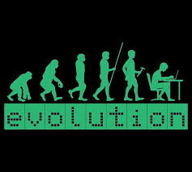
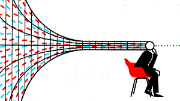

During my code writing evolution, I have encountered a plethora of functional issues that have left me confused and frustrated in my inability to code effectively.  As much as these instances have embittered me, the reward of having that “eureka” moment and watching my code perform as intended would wash away the torment, and that pain becomes a memory event.  While riding this emotional roller coaster, I have noticed certain issues that seem to echo throughout my experiences.  I’ve found that the longer I’ve tried to make an issue work, the faster I recall a solution for that particular dilemma in future encounters.  Yes, you can label this as a corollary of learning but I want to emphasize that the solution to such problems are consistently being reiterated.  On the surface, I could inflate my ego with the idea of being an evolved “coding wizard”, but if you peel back the issue, you can see how cyclical they can be and the resolution can be refashioned.

An example of such an issue can be observed when I’m writing code to perform a function and I’m consistently thinking of scenario’s that could possibly happen.  I always run into the scenario of “if this then that”.  These situations often require me to create objects that wait for a certain input or state to happen in order to be used.  It is a handy design that observes any change in data and redirects or manipulates the resulting data to perform yet another function or result.  I think the biggest exploitation of this method is when I try to catch errors.  If I require the user to input an integer for a calculation, I’m not only waiting for that input to be manipulated by an object in waiting, but I’m also anticipating an error by the user in case they input something other than an integer.

In a recent project, I incorporated a process for developing a web application into several functioning parts.  This was the best approach to measure and manipulate the data received from the user.  Between our team of developers, we would split the functionalities which catered to our individual strengths.  For instance, our member that demonstrated strengths in database control gave the model of where the information is used.  Another individual felt comfortable in their abilities in user interface which allowed the user to view the data and request additional data.  We also had another individual control how this information is processed between the database and the user interface.  This coordination is very complicated, but very efficient because it plays on the strengths of the individual team members.

By working as a team or handling reoccurring problems alone, there are many different ways to take on a project or troubleshoot dilemmas in coding.  Most of what I’ve observed is a combination of what I’ve learned, as well as what I observe.  I may be a novice in the overall scheme of programming, but I am starting to see the patterns that reveal the best resolution to the programming process.

