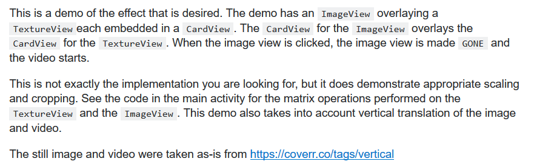
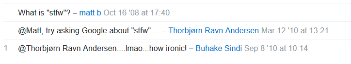

Through my experience in the Air Force, I have shaped and refined my work ethic based on my observations.  The one thing that I can distinguish myself from the talented masses, is my name.   What I mean by that is how my name, and everything I put my name on, is a reflection of me.  Whatever I do in life, I try to be conscious of what my name should mean to other people.  My aim is for excellence, and I want the idea of my name to be associated with that.  This is why I endorse the implementation of ESLint with IntelliJ.
I can see the importance of uniformity and standards in writing code.  These attributes help define excellence by creating an environment that is easy to follow and understand.  The implementation of ESLint gives you a confirmation of your “p’s and q’s”.  Initially, I had my reservations of this process since I wanted my code to reflect my style.  For example, I created a habit of inputting my curly braces on their own separate lines which gave me a visual “box” that defined each function and algorithm.  Syntactically it worked and it did seem appealing.   The issue that I ran into was that my method was inconsistent.  This inconsistency could be perceived as sloppy, and that is not how I want my work to be perceived as.
One of the drawbacks that I found is that it doesn’t debug your program.  Granted, it isn’t the purpose of the implementation, but it really would be a great addition, wouldn’t it?  The reason why I brought this up is because I managed to write some code that passed all of the benchmarks.  Unfortunately, when I tried to run my program, I failed to implement the programs purpose, resulting in errors.  My code may have been aesthetically pleasing, it just lacked in functional principle.  Speaking of errors, the ambiguity of errors received from ESLint would be another issue I would have.  It would be convenient to have an inclusive library that defined the faults given to aid in resolving such matters.  These minor caveats are my best attempts at finding faults with the implementation of ESLint.
	Overall, I feel that ESLint should be a standard for writing code in JavaScript.  Much like spellchecking before submitting a paper, that green checkmark in the corner is an approval of outstanding grammar.  I know that the image of coding excellence is subjective.  In my opinion, standards mean consistency, universal understanding, and appeal.  This is exactly what I want my work to be defined as.  Even though I may sacrifice a celebrity status as “that guy that writes with single line curly braces”, I find it more important for people to understand that I produce excellent work.

