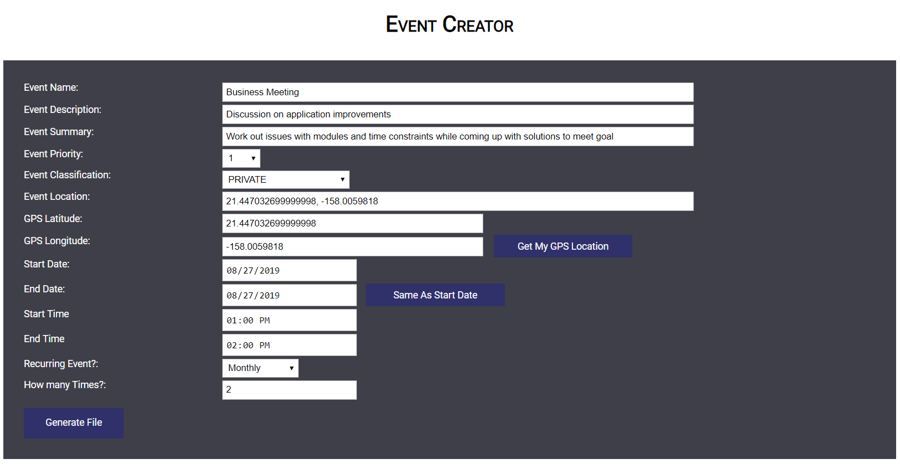

## Overview
Over the Summer of 2019, while attending my software engineering II course at the University of Hawaii at Manoa, my partner and I were given a task to create a calendar event generator that could be read and implemented on multiple platforms.  This project allowed us to collaborate on the type of language to use, as well as how to implement the program bounded only by the compliance of RFC 5545 formatting.
 
## Objective
Our program generated a calendar event file based on details of the user input.  The required features for this program were to implement a classification (public, private, or confidential), priority (0-9 depending on importance), version, time zone identifier, summary of event, start and end dates/times, geographic positioning, and event recurrence.  These features had to comply with RFC 5545 standards and formatting, and the information collected was saved in an .ics file that is shared and utilized by cross platform calendaring systems like Outlook, Google Calendar, Mac OS, and mobile.  Our team decided to invoke this program in JavaScript, Html, and CSS through the use of IntelliJ while documenting our progress on GitHub.  In addition, we used the program Slack as our medium for communication. 

## Experience

It was an interesting experience to adopt the agile method of “sprints” to accomplish the tasks in tangible components that we could digest weekly.  Our meetings at the end of each week allowed us to keep track of our goal as well as permitting us to strategize solutions to issues that came up.  Without a doubt, it was an enjoyable experience!  I created the initial skeleton of fields that were required and I took on the global positioning feature that utilized the browser’s global position as an input for the event.  I then moved on to the meticulous details that were required for the RFC 5545 format.  I learned the value of being in sync with your group, no matter the project stage.  I also took value in the process of deciding on a language and a best course of action to such an open situation.  
<br\>
You can view my web application and journey [here](https://github.com/team-cannelloni/ICS-Event-Generator/)
