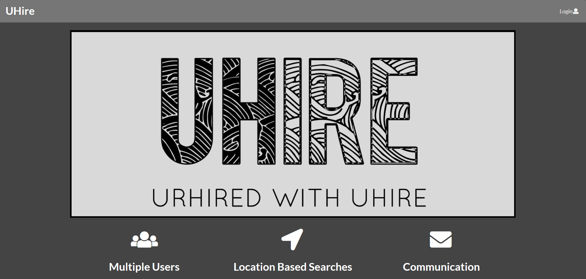
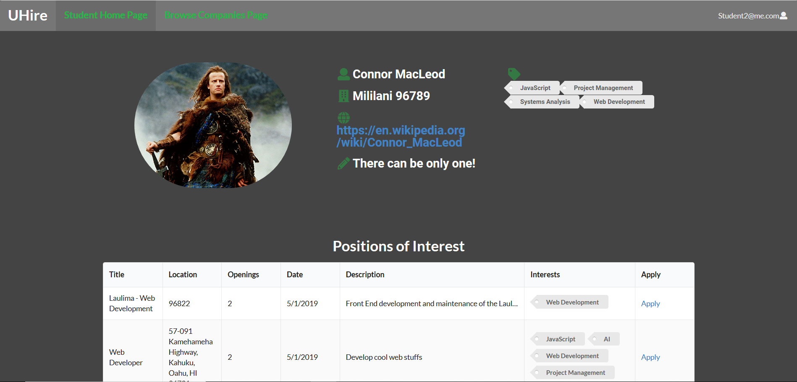
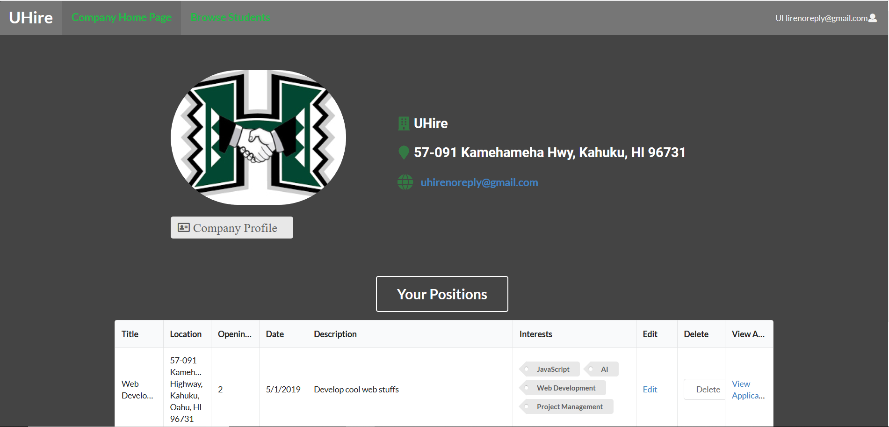
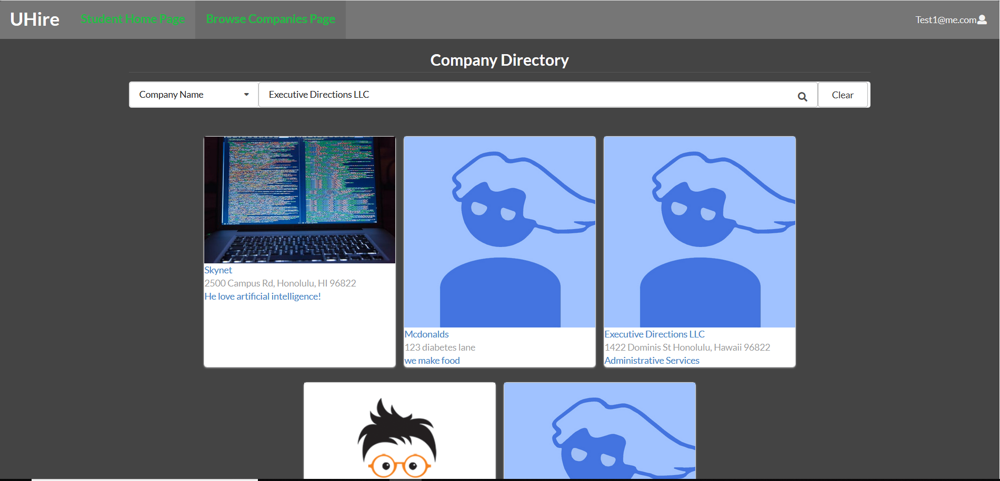

## Overview
Over the Summer of 2019, while attending my software engineering II course at the University of Hawaii at Manoa, my partner and I were given a task to implement a calendar event generator that could be read and implemented on multiple platforms.  This project allowed us to collaborate on the type of language to use, as well as how we would implement the program bounded only with the compliance of RFC 5545 formatting.

  
  
  
  

 
## Objective
Our program generated a calendar event files based on details of the user input.  The required features for this program were to implement a classification (public, private, or confidential), priority (0-9 depending on importance), version, time zone identifier, summary of event, start and end dates/times, geographic positioning, and event recurrence.  These features had to comply with RFC 5545 standards and formatting, and the information collected was saved in a .ics file that could be shared and utilized by cross platform calendaring systems like Outlook, Google Calendar, Mac OS, and mobile.  Our team decided to implement this program in JavaScript, Html, and CSS through the use of IntelliJ while documenting our progress on GitHub.  We also used the program Slack as our medium for communication. 
## Experience
It was an interesting experience to adopt the agile component of “sprints” to accomplish the tasks in tangible components that we could digest weekly.  Our meetings at the end of each week allowed us to keep track of our goal as well as a chance to strategize solutions to issues that came up.  It was definitely an enjoyable experience!  I created the initial skeleton of fields that were required and I took on the global positioning feature that utilized the browser’s global position as an input for the event.  I then moved on to the meticulous details that were required for the RFC 5545 format.  I learned the value of being in sync with your group, no matter the project stage.  I also took value in the process of deciding on a language and a best course of action to such an open situation.  You can view my web application and journey [here](https://github.com/team-cannelloni/ICS-Event-Generator/)
The biggest thing that I learned from this experience is the importance of communication and teamwork.  I was fortunate enough to have a good team, but I can see how ineffective communication or time restrictive dependencies could certainly slow down the productive process.  I also learned how JavaScript and the Meteor framework could be both challenging and enjoyable to work with.  These experiences gave me an awareness of all the details that go into creating a web application.  You can view my web application and journey [here](https://github.com/uhire/)

