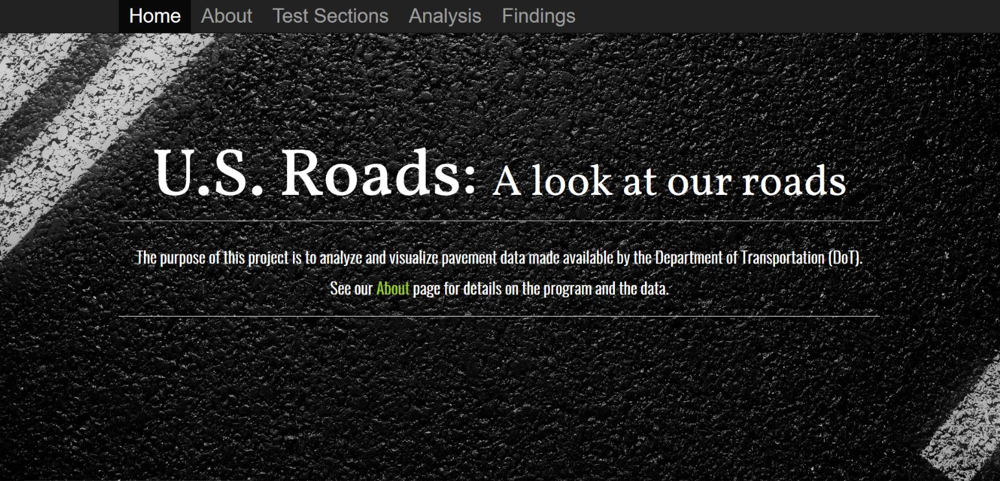
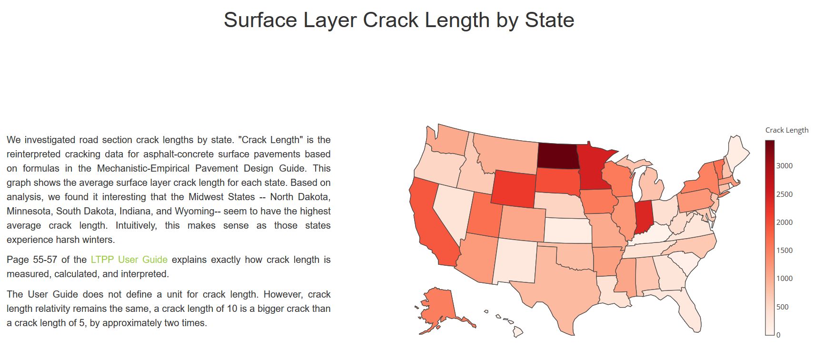
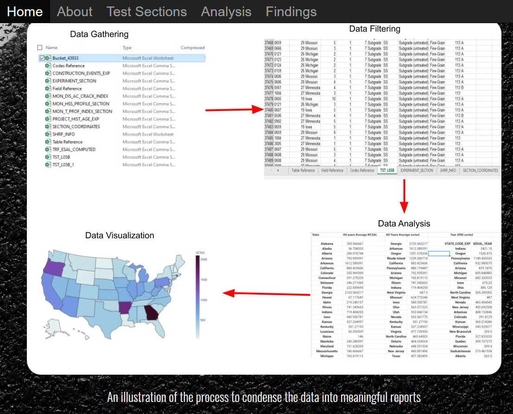
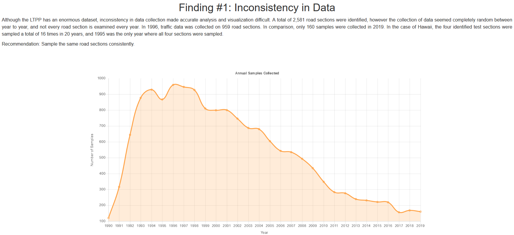

## Overview
During the fall semester of 2020 at the University of Hawaii at Manoa, I collaborated with 2 other student developers to create a web application that analyzes and visualizes the pavement data extracted from the Department of Transportation's Long Term Pavement Program (LTPP) database.  This web application utilizes the JavaScript web framework, React.JS along with visualization aids from Plotly.JS and Chart.JS.  As a management tool, our team used Github to coordinate updates and bug control.  The project took about a month and a half to process the information, analyze it, normalize the data, and display the findings. Our preferance for communication took place on Zoom and Google meet which is a public messaging application.
 
 

## Objective
The challenge that we took on, was to make sense of the abundant amount of data that was provided by the LTPP database.  This data was amassed over a 20 year period.  It comprised of 12 spreadsheets that withheld numerous worksheets within them.  For instance, one worksheet in particular contained over 37,000 lines of data.  In order to filter these sheets, we condensed the information into the 50 states, so that we could produce meaningful reports to analyze.  We would then produce the visualizations to help convey what the data is trying to say. Once we had the processed data, building the application was a lot of fun.  I created the background design and provided the graphs to best visualize all of the processed data that were made available.
 
 

## Experience
One of the biggest takeaways from this experience is the importance of communication and teamwork.  This experience also taught me that collecting data is not enough to produce meaningful results.  One of our most paramount findings from analyzing this data is that the information provided is horrifically inconsistent.  This inconsistency has led to difficulties in data accuracy and visualization cohesivenes.  Consistency, and thorough data collection is essential to understand trends, pitfalls, and improvements.  Having an understanding of the variety of graphs to help display data was an invaluable lesson that I plan on utilizing in my future projects.
 
 

 
You can view my web application [here](https://roadscholars.github.io/)
You can also view my repository [here](https://github.com/RoadScholars/roadscholars.github.io)
 
 
