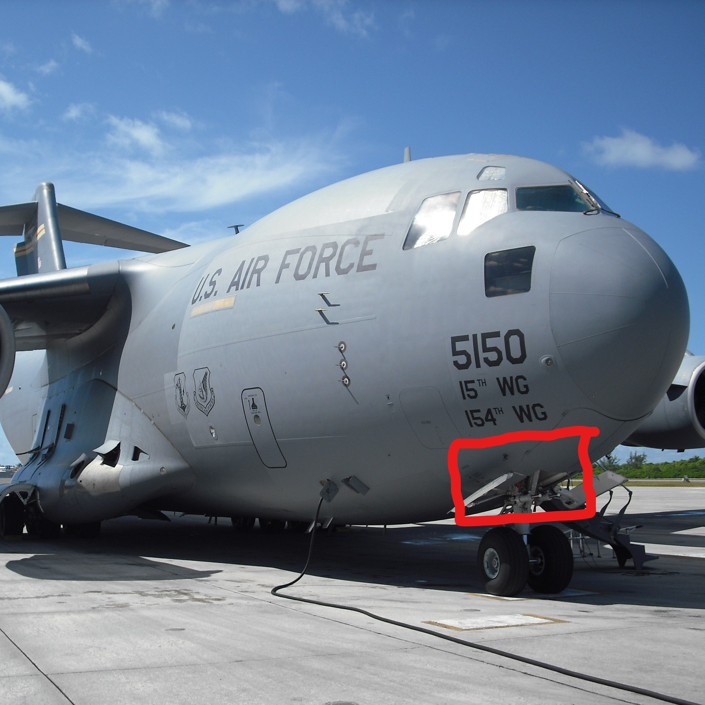
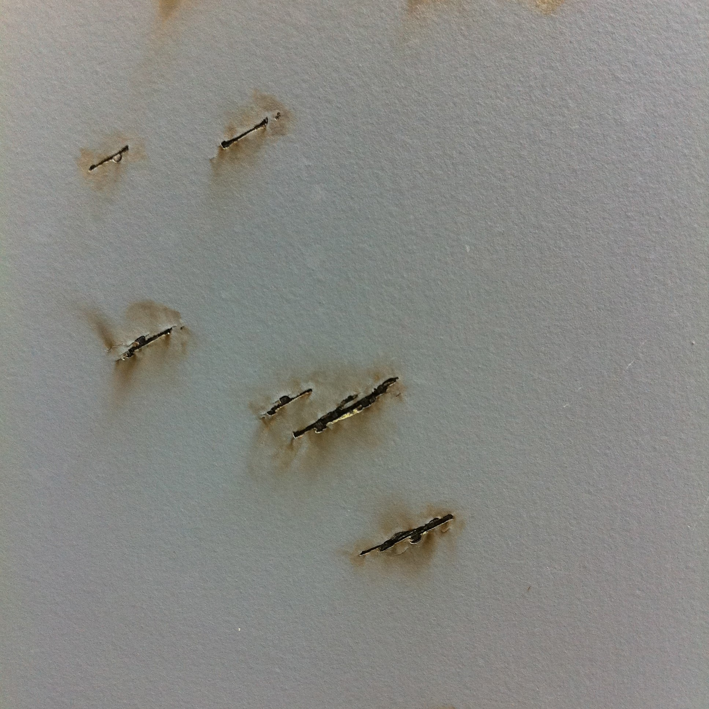

 
 

 
 
The aircraft that I work on is a C-17 Globemaster, and during the summer of 2011 it experienced a lightning strike on take-off from the Honolulu runway.  Lightning strikes are fairly uncommon, but this incident was unique in its application.  The mission for the day was trying to launch out before the projected storm rolled in.  As the aircraft breached a cloud during take-off, lightning struck throughout the underbelly of the aircraft.  The crew had no choice but to abort the mission and return to base for damage assessment.
 
 
  
 
  
 
 
I was put in charge of the inspection team, which was a collaboration of maintenance specialties.  Hydraulic, Engine, Avionics, Structural, Electrical, Communications, and Mechanical professionals were dispatched and coordinated to ensure that a thorough inspection was performed.  I ensured that these agencies were operating without interfering with their respective inspections, and reporting the results to management.  Fortunately, the damage was minimal and cosmetic.  The electronics were unaffected, and the structural integrity was sound.  This experience taught me teamwork with agencies outside of my known field, as well as a science lesson that lightning can strike upwards

