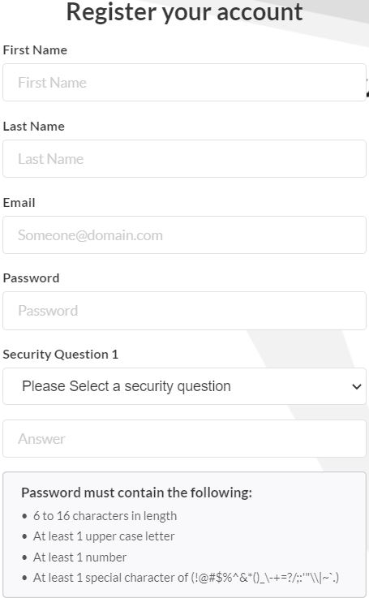
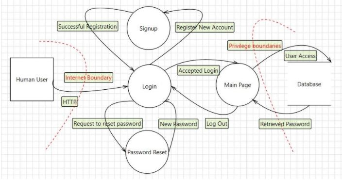
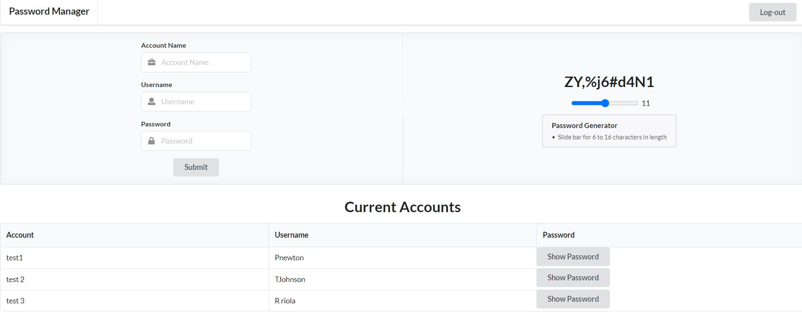

## Concept

During the course of my Summer Session I at the University of Hawaii at Manoa, I took the Software Quality Assurance class which focused on developing programs while focusing on potential security risks as part of information assurance.  This course enhanced coding practices to mitigate possible threats and strengthen cybersecurity.  The group project that we had to accomplish could be written in any language of our choosing, but have a functionality that is both useful and secure.  Due to the time restraints, communication and time management were key to completing this task.  My partners Roderick Tabalba, Weile Line and I agreed to create a password manager web application that will not only store your passwords securely, but has a feature to create randomized passwords as well. 
## Overview
The task had its challenges considering that neither one of us had experience in writing “secure” code.  We all felt comfortable with writing in JavaScript so we decided to utilize that language with the IntelliJ IDE and Github for our project documentation and tracking. During our initial attack surface analysis, we found that our main weak points would be the input fields for logging in.  We incorporated input limits to prevent buffer overflows, character limits to prevent injections, incorporated JWTokens to ensure user authentication, and as a vulnerability safeguard, we created a 10-minute inactive logout.  Since we were using MongDB for our database, we ensured password security with a hash and salt encryption.
## Experience
 
 

The experience was enlightening!  I never knew how susceptible programs are to a variety of attacks.  The information garnered from this class will be part of my repertoire of techniques for future coding projects.  Our web application was a success.  We were able to complete the program with added security measures.  The password generator is customizable to length.  Once the information is added to the database, it is displayed on a list field.  The passwords are hidden from this field initially, until you select an account.  As an added precaution, you are prompted to input the master password to reveal the selected password.  Excellent teamwork, constant communication, and a motivated support system ensured the success of our project.  You can see the Github repository here.
