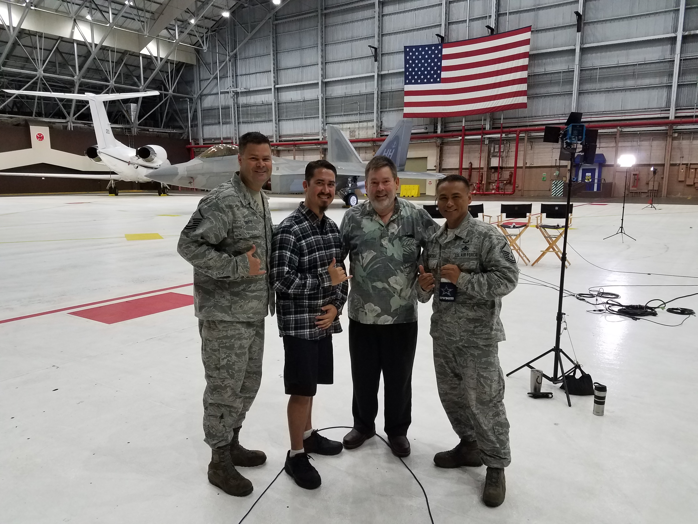

On the 7th of December 2017, Joint Base Pearl Harbor Hickam held ceremonies to honor the 76th anniversary of the lives lost during the Pearl Harbor attack.  These ceremonies were documented by the Hawaii News Now journalists as part of their Sunrise program.  During the program segment, Hawaii News Now reported on the history of the attacks on the military airfields throughout Oahu, as well as the infamous attack on the naval ships in Pearl Harbor.  The segment connected the life of that past and transitioned the activities of the present which provided a glimpse of the future.

 
 
I was chosen to represent our organization to exemplify the current activities of Hickam.  Howard Dicus of Hawaii News Now, interviewed Master Sergeant Ryan Smith and myself on the daily operations and challenges that we face while maintaining aircraft at the 15th Aircraft Maintenance Squadron.  None of the questions were practiced or planned and the segment was shot live at five in the morning.  Facing the pressures of an impromptu speech, the fatigue of an early morning interview, and the realization that the entire state could view or judge my input during a nationally sensitive event, I learned how to keep a calm head and organize my thoughts on the fly. 

The moment I had an opportunity to reflect on everything which transpired from that day, I realized a new-found appreciation for the sacrifice that the military members gave during the attack.  I also developed an appreciation for the production of news segments and the unscripted professionalism that Howard Dicus and the rest of the Hawaii News Now crew exuded while performing their jobs.

 
 You can view the interview at [Hawaii News Now](http://www.hawaiinewsnow.com/clip/13964389/sunrise-on-the-road-joint-base-pearl-harbor-hickam-aircraft-maintenance/)
