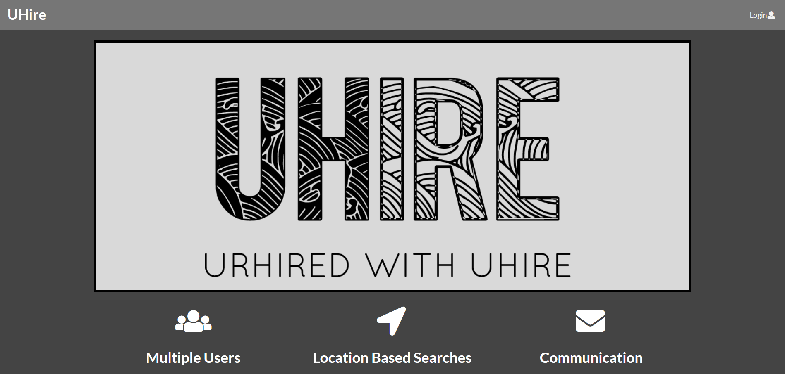
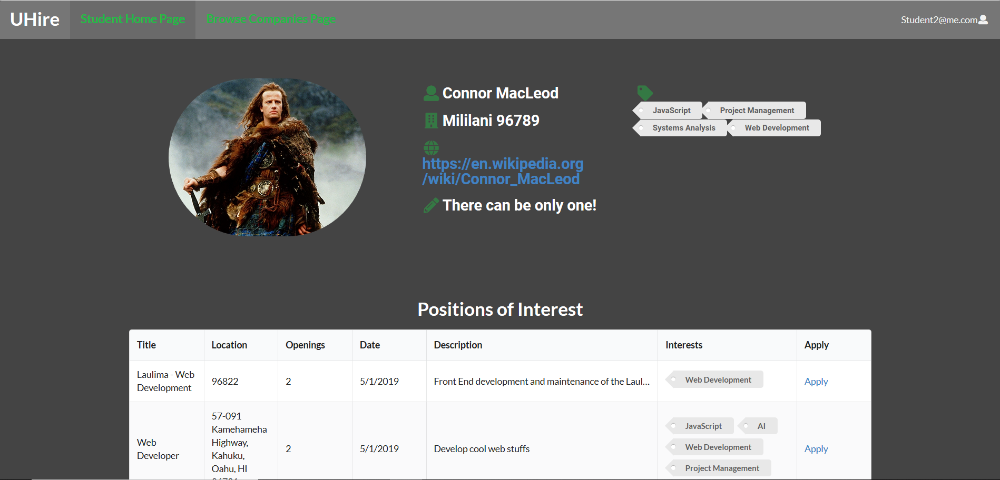
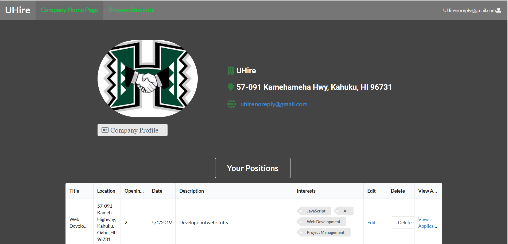
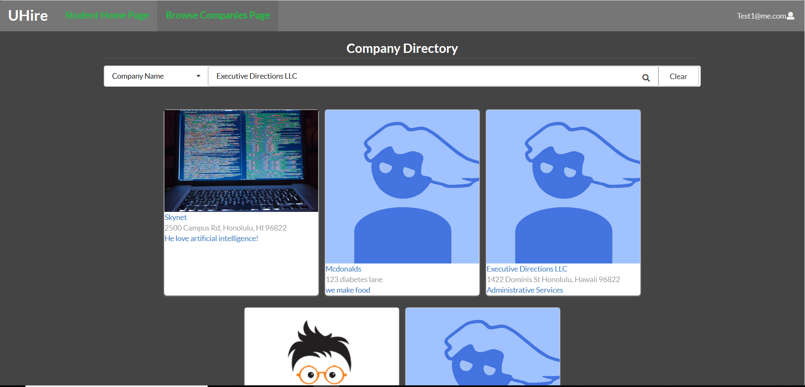

## Overview
During the spring semester of 2019 at the University of Hawaii at Manoa, I collaborated with 4 other student developers to create a web application called UHire, which utilizes the JavaScript web framework, Meteor.  With this application being written using Node.js, we applied IntlliJ as our editor, MongoDB to store our database and ESlint as our quality control.  To help manage our project, we appropriated Github, which is an excellent tool for source code management.  The project took about a month to put together and the majority of our communication took place on Slack which is a public messaging application.

## Objective
The premise behind the application was to provide a service to students and employers which helped matched interests, skills, and location desires.  Students and companies build profiles that are searchable and selectable depending on the job positions that companies create, and the students applying for such positions.  Building the application was a lot of fun.  I initially set up the backend design with user collections and permissions and as time progressed, I moved to front-end user interface design.

## Experience
The biggest thing that I learned from this experience is the importance of communication and teamwork.  I was fortunate enough to have a good team, but I can see how ineffective communication or time restrictive dependencies could certainly slow down the productive process.  I also learned how JavaScript and the Meteor framework could be both challenging and enjoyable to work with.  These experiences gave me an awareness of all the details that go into creating a web application.  

 
You can view my web application and journey [here](https://github.com/uhire/)

