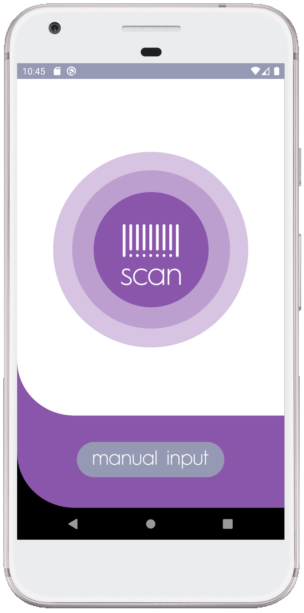
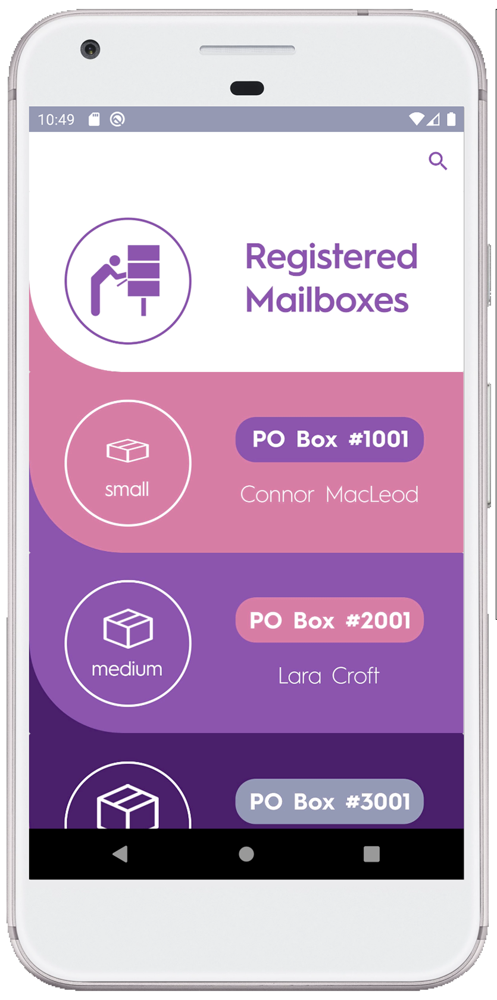

## Concept

While attending a Design for Mobile Devices course during the Spring Semester of 2020 at the University of Hawaii, a project was assigned to develop an application on the Android system.  While brainstorming ideas, my project partner disclosed an issue that he was having with P.O. boxes.  He would take time out of his day to check a family member’s P.O. box only to find it empty.  This inconvenience would compound financially with subsequent unsuccessful trips.  Thus, the concept for our application was born.  A mobile solution that will notify the user the moment any parcel products are placed within the user’s P.O. box.
## Overview
This project offered some challenges to overcome since neither my partner nor I have ever dealt with programming for mobile devices.  We utilized the Android Studio integrated development environment, which is built on the IntelliJ IDEA software.  This meant JavaScript, HTML, and CSS languages were used for this platform.  As my partner and I were learning how to code for Android, we developed the framework of our application’s purpose.  Due to time constraints, capabilities, and practicality, certain features and concepts had to be removed in order to complete our task.  Initially, we conceived the application to appeal to the user as well as the operator (post office employee, etc.).  Our team found it impractical to have a user function with its associated features and ultimately decided to focus on the operator.
## Final Product

Once we completed the application, we ran it through several evaluation trials before releasing the final product.  Once the application passed debugging, we released it for user evaluation.  Due to the onset of the COVID-19 pandemic, our face to face user trials were extremely limited, but the feedback that we received was very helpful in refining our final product.  The primary use for the application is to utilize the bar code scanning feature.  If that feature can not be utilized, then a manual option has been implemented.  A database of accounts is searchable by P.O. box number.  When an account is selected or scanned, the mail type page will give options on what type of parcel products are being placed in the box.  A confirmation page reinforces the accuracy of the notification before it is sent to the owner of the P.O. box.  This application was built for speed, efficiency and accuracy to save the user time and money from checking an empty P.O. box.  
Overall, this experience has been a fun adventure in learning how to code for mobile devices.  I learned the importance of user evaluations and feedback, so that I can evaluate what users like or dislike.  It is often too easy to get caught up in designing and coding while losing sight of appealing to the targeted users.  I have also learned the importance of excellent teamwork and communication.  These traits were essential in the prompt delivery and heightened functionality of the application.  

To see a presentation of the application, click [here](https://youtu.be/g9V9sGhEgdI).  To see the Github repository for the application, click [here](https://github.com/Smoke-Signal-Development-Team/YouveGotMail).
